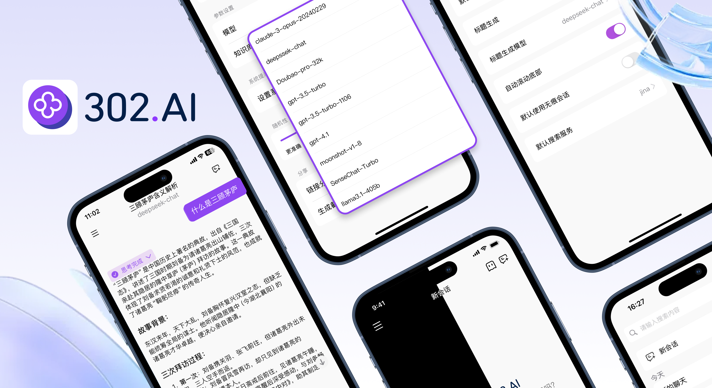

<h1 align="center">

<span>
    302.AI App
</span>
</h1>
 
<p align="center">
<em>302.AI 是一款功能强大的 AI 智能聊天应用，为您开启全新的对话体验。我们汇聚了市面上主流的各类顶尖 AI 模型，包括 Deepseek、Qwen、ChatGPT 等，让您一站式畅享前沿 AI 技术的魅力。</em>
</p>

<p align="center"><a href="https://apps.apple.com/us/app/302-ai/id6744959746" target="blank"></a></p >

<div align="center">

[](https://302.ai)
[](https://github.com/302ai/302AI-iOSAPP)
[](mailto:support@302.ai)

</div>

<p align="center"><a href="README_zh.md">中文</a> | <a href="README.md">English</a> | <a href="README_ja.md">日本語</a></p>



## 🆕 全新升级

在新版本的 302.AI App 中，我们对界面和交互体验做了全面升级，带来了更极致的视觉与操作体验：
- 🌈 全新UI设计，布局更清晰，交互更流畅
- 🛡️ 新增无痕会话模式，保护您的隐私
- 🌍 支持多语言切换，满足不同用户需求
- 🔑 支持邮箱登录及手机登录302.AI账号，注册和登录更加便捷
- 🌟 更多贴心细节优化，等你来体验

## 🌟 主要特点

### 💬 AI 聊天功能（全新升级）
- 🤖 集合多模型，告别频繁切换 App（支持 Deepseek、Qwen、ChatGPT、Doubao 等众多 AI 模型）
- 👍👎 消息点赞/点踩功能，支持对 AI 回复进行反馈
- 🖼️ 会话截图，支持一键截图长对话
- 📋 支持选择/复制对话内容，操作更便捷
- 📚 上下文记忆，智能对话
- 🎯 自定义系统提示词
- 🔕 支持无痕会话，聊天内容不留痕迹，保护隐私

### 🖼️ 图像处理功能
- 📸 图片上传与 AI 分析
- 🔍 图像内容智能识别
- 📱 支持多种图片格式

### 🎙️ 语音功能
- 🎤 语音输入识别
- 🗣️ 实时语音转文字
- 🎵 音频文件支持

### 🛠️ 高级功能
- 🌐 联网搜索
- 🔍 思考模式
- 📝 Markdown 渲染

### 🎨 用户体验
- 🌙 深浅主题切换
- 🌍 支持多语言切换

## 🚀 快速开始

### ⚡ 安装与使用

#### 方式一：通过 App Store（推荐）

[点击安装](https://apps.apple.com/us/app/302-ai/id6744959746)

#### 方式二：开发者安装
```bash
# 1️⃣ 克隆项目
git clone https://github.com/302ai/302AI-iOSAPP.git
cd 302AI-iOSAPP

# 2️⃣ 使用 Xcode 打开项目
open Chat302AI.xcodeproj

# 3️⃣ 配置开发团队和Bundle ID

# 4️⃣ 运行项目 🎉
# 在 Xcode 中选择目标设备并运行
```

## 📄 许可证

本项目基于 [MIT](LICENSE) 开源协议，你可以自由使用、修改和分发。

## ✨ 302.AI介绍 ✨
[302.AI](https://302.ai)是一个按需付费的AI应用平台，为用户解决AI用于实践的最后一公里问题。
1. 🧠 集合了最新最全的AI能力和品牌，包括但不限于语言模型、图像模型、声音模型、视频模型。
2. 🚀 在基础模型上进行深度应用开发，我们开发真正的AI产品，而不是简单的对话机器人
3. 💰 零月费，所有功能按需付费，全面开放，做到真正的门槛低，上限高。
4. 🛠 功能强大的管理后台，面向团队和中小企业，一人管理，多人使用。
5. 🔗 所有AI能力均提供API接入，所有工具开源可自行定制（进行中）。
6. 💡 强大的开发团队，每周推出2-3个新应用，产品每日更新。有兴趣加入的开发者也欢迎联系我们
